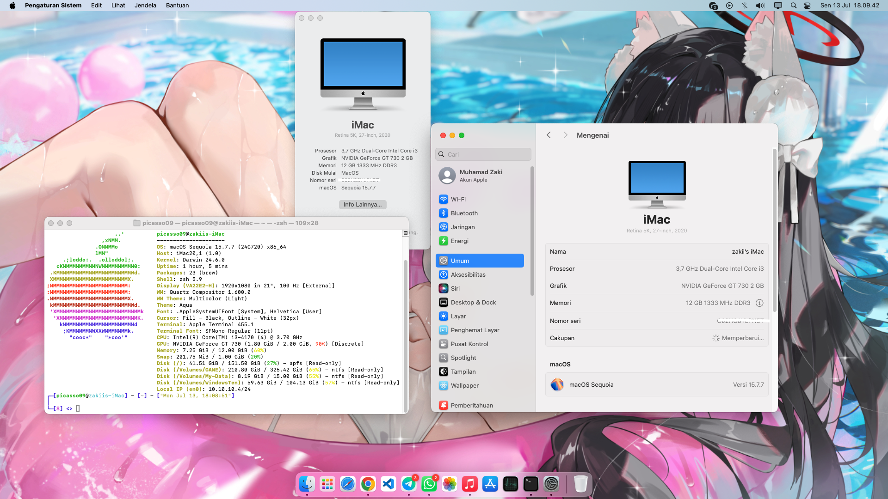

# 🛠️ MacOS Sequoia Haswell OpenCore 1.0.7

My daily driver Hackintosh configuration for Haswell (4th-Gen) of Intel Core running with H81 chipset.

## Configuration

| Specification | Details                                                                                   |
| ------------- | ----------------------------------------------------------------------------------------- |
| Motherboard   | MSI H81-P33                                                                               |
| Processor     | Intel Core i3-4170 @ 3.70 Ghz                                                             |
| Graphics      | NVIDIA GeForce GT 730 2G(Kepler/GK208)[^3]                                                |
| Audio         | Realtek ALC887 (`alcid=7`)                                                                |
| Network       | Realtek® RTL8111G Onboard                                                                 |
| Bluetooth     | TP-Link UB500 (RTL8761BU)                                                                 |
| Boot-Args     | `amfi=0x80 ipc_control_port_options=0 alcid=7` |
| SMBIOS        | iMac20,1 (Desktop with dGPU)[^2]                                                          |

> [!NOTE]
> 
> -   `amfi_get_out_of_my_way=0x1` is a workaround to fix Haswell graphics using OCLP[^1].
> -   `ipc_control_port_options=0` is a workaround to fix crashing issue of some apps (Skype, WhatsApp, Spotify, etc.)

## Disabling SIP (System Integrity Protection)

If you are using an incompatible graphic card (dropped support, etc.) you should disable SIP (System Integrity Protection) to patch your unsupported graphic card with OCLP (OpenCore-Legacy-Patcher)[^1]. This enables your system to fully use GPU acceleration feature.

1. Launch a terminal (iTerm2 or stock) and type these command

    ```sh
    $ sudo spctl --master-disable
    ```

2. Restart your PC, and enter recovery (dmg) image of your macOS drive
3. On the menu bar, choose Utility > Terminal and type these command
    ```sh
    $ csrutil disable
    $ csrutil authenticated-root disable
    ```
4. Restart and boot to your system.

## 🔧 Improvements

-   This version was initially prepared using OpenCore 1.0.7 for macOS Tahoe (26).
-   This EFI config has been tested on macOS Sequoia and it was running well (15.7.7).
-   This EFI config has not yet been tested with macOS Tahoe (26). I don't know if this version is still Hackintosh-able or if it still supports Intel-based systems. This version is still in the Developer Beta stage at the time of writing this text.

> [!NOTE]
> If you want to upgrading to latest macOS version such as Tahoe (26) or newer version, take a look at supported device models first and just change the SMBIOS on the `config.plist` with the supported SMBIOS value using GenSMBIOS tool and you are ready to upgrade.

## 🖼️ Screenshots

These are screenshots that I took on macOS Sequoia (version 15.7.7).



[^1]: OCLP (OpenCore Legacy Patcher) is a Python-based project for both running and unlocking features in macOS on supported and unsupported Macs, such as Patching GPU drivers.
[^2]: For those using desktop with iGPU (Integrated GPU), they should use `iMac18,1` for their SMBIOS.
[^3]: Highest Supported OS for NVIDIA Kepler GPU series are macOS Big Sur (11). Further macOS version needs to be patched with OCLP.

Thx: @azukashi For reverence